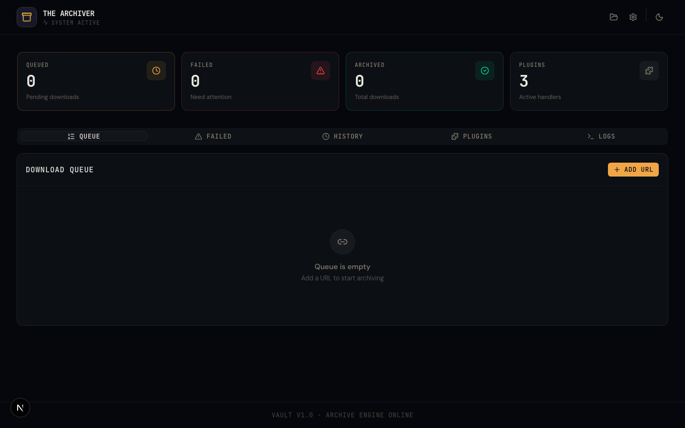
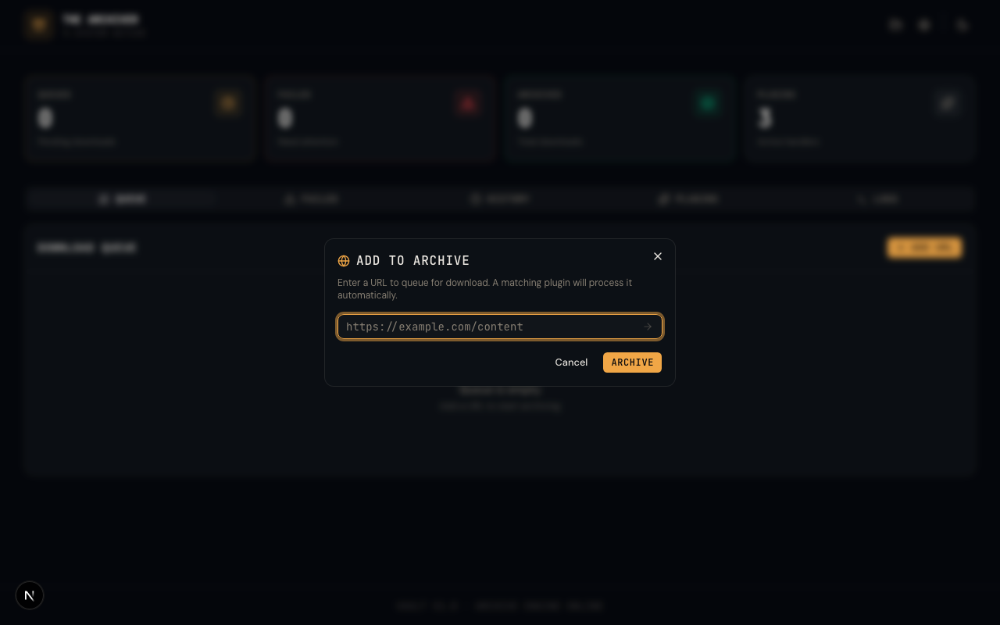
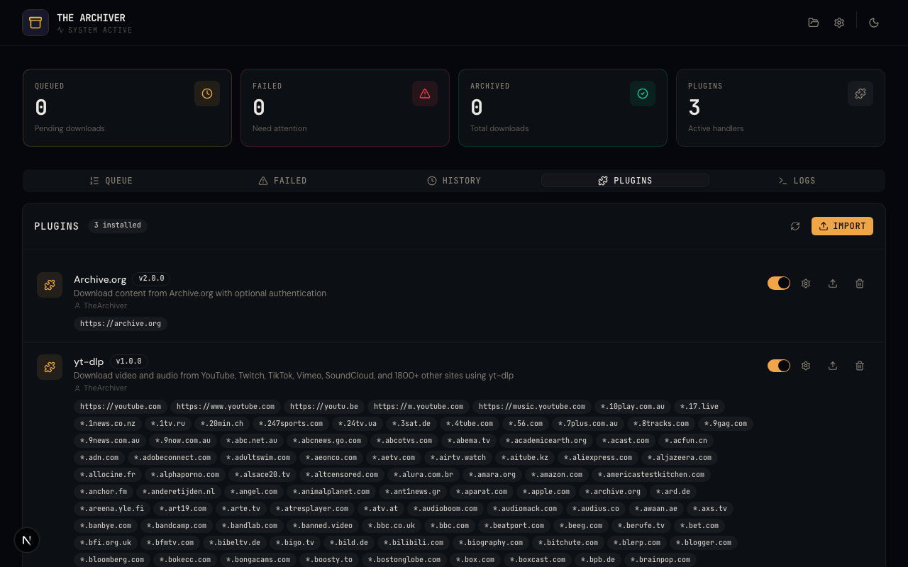
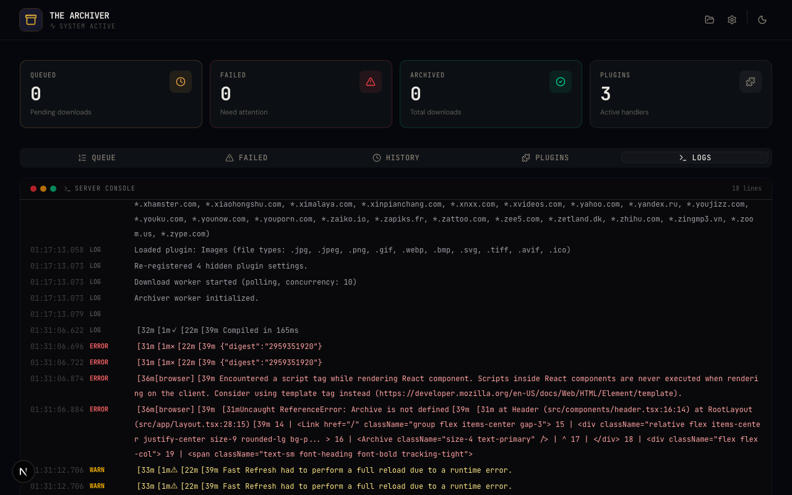
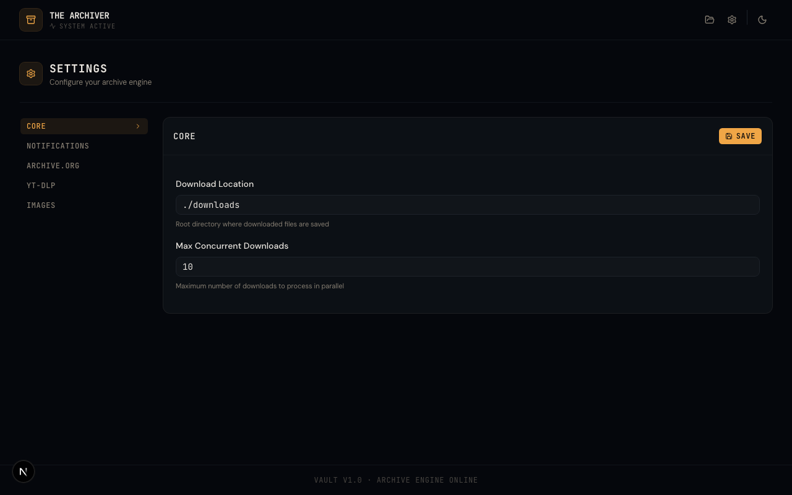
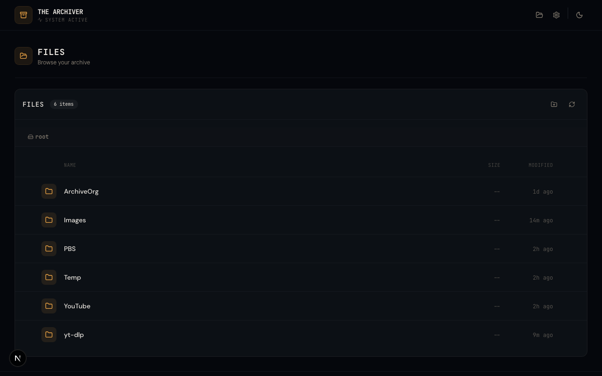
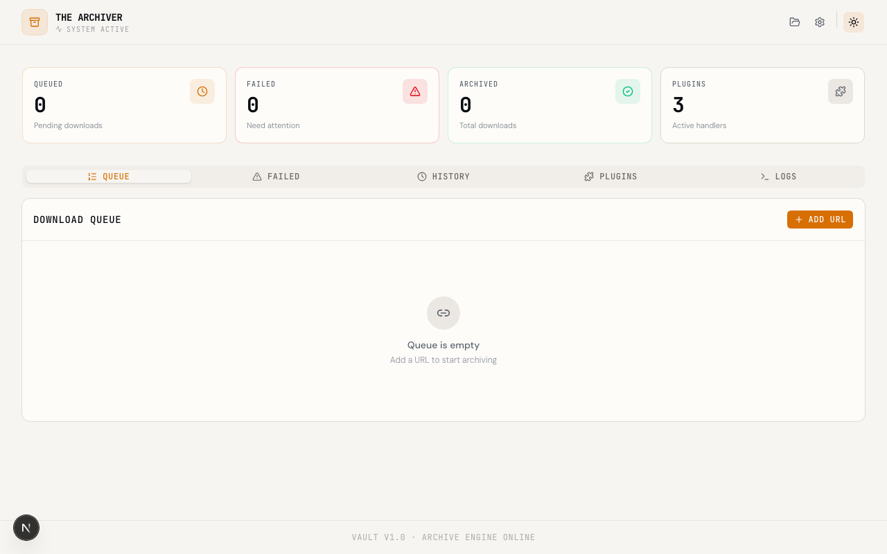

<p align="center">
  
</p>

<h1 align="center">The Archiver</h1>

<p align="center">
  <strong>A self-hosted, plugin-based web content archiver</strong><br/>
  Save anything from the web to your own server — from any device, with a single API call.
</p>

<p align="center">
  <a href="https://pauljoda.github.io/TheArchiver/">Website</a> &bull;
  <a href="#quick-start">Quick Start</a> &bull;
  <a href="#why-the-archiver">Why</a> &bull;
  <a href="#features">Features</a> &bull;
  <a href="#archive-from-anywhere">Archive from Anywhere</a> &bull;
  <a href="#plugin-system">Plugins</a> &bull;
  <a href="#api-reference">API</a> &bull;
  <a href="#development">Development</a>
</p>

---

## Why The Archiver?

You find something online you want to keep — a YouTube video, an image gallery, a page from Archive.org. You want it saved to your own server, organized, and available offline. You don't want to SSH in and run a script. You want to tap "Share" on your phone and have it just happen.

**The Archiver** is a self-hosted web app that turns any URL into a download. Submit a link through the dashboard, the REST API, or a mobile shortcut — a matching plugin picks it up, downloads the content, and saves it to your local disk. No cloud services, no subscriptions, no external dependencies. One Docker container, one SQLite database, done.

---

## Screenshots

<details open>
<summary><strong>Dashboard</strong> — Queue, stats, and real-time monitoring</summary>
<br/>

</details>

<details>
<summary><strong>Add to Archive</strong> — Submit any URL for download</summary>
<br/>

</details>

<details>
<summary><strong>Plugin Management</strong> — Install, configure, enable/disable plugins</summary>
<br/>

</details>

<details>
<summary><strong>Server Console</strong> — Live log output with color-coded levels</summary>
<br/>

</details>

<details>
<summary><strong>Settings</strong> — Grouped configuration for core and per-plugin settings</summary>
<br/>

</details>

<details>
<summary><strong>File Browser</strong> — Browse, manage, and download archived content</summary>
<br/>

</details>

<details>
<summary><strong>Light Theme</strong> — System-aware theme with manual toggle</summary>
<br/>

</details>

---

## Quick Start

### Docker Compose (recommended)

```bash
docker compose up -d
```

### Docker Run

```bash
docker run -d \
  -p 3000:3000 \
  -v ./data:/data \
  -v ./downloads:/downloads \
  -v ./plugins:/plugins \
  ghcr.io/pauljoda/the-archiver:latest
```

Open [http://localhost:3000](http://localhost:3000) to access the dashboard.

---

## Features

### Dashboard
At-a-glance stats for queued, failed, and archived downloads with a count of active plugins. The tabbed interface gives you access to the download queue, failed items, history, schedules, plugins, and server logs — all in one place. Dashboard data auto-refreshes every 5 seconds.

### Download Queue
Submit any URL via the **Add URL** button or the REST API. A matching plugin picks it up automatically and downloads the content to your configured directory. Monitor progress in real-time via Server-Sent Events. A built-in "Files" plugin acts as a universal fallback — any URL that no other plugin matches will be downloaded directly, with files automatically organized into folders by extension (Images, Videos, Audio, Documents, etc.).

### Scheduled Archiving
Cron-like system to automatically re-queue URLs on a repeating schedule. Create schedules with simple interval presets (every 6h, 12h, daily, weekly) or advanced custom cron expressions. Each schedule tracks last run time and next scheduled run, with enable/disable and "Run Now" controls.

### Plugin System
Drop-in TypeScript plugins matched by URL pattern. Install plugins by uploading a `.zip` file, place them directly in the `plugins/` directory, or browse and install from the **community plugin marketplace** in the UI. Enable, disable, configure, and update plugins from the UI without restarting the server. Plugins can declare their own settings, custom file browser views, file preview providers, and thumbnail providers. Drag-and-drop reordering controls which plugin matches a URL first.

### File Browser
Browse your entire download archive from the browser. Create folders, rename, move, copy, and delete files. Multi-select with shift+click and batch operations. Download individual files or entire directories as zip archives. Video files display extracted frame thumbnails. Folder cards show multi-image collages, sub-directory pills, or text snippet previews.

### File Preview
Click any file to open a full-viewport preview overlay with keyboard navigation between files:
- **Images** — jpg, png, gif, webp, svg, avif, tiff with click-to-zoom
- **Video** — mp4, webm, mov with native controls and HTTP Range seeking; HLS streaming for large files
- **Audio** — mp3, flac, wav, ogg, aac, wma, m4a
- **Text/Code** — txt, md, json, xml, html, css, js, ts, py, sh, yaml, csv with line numbers
- **PDF** — embedded browser viewer
- **Plugin previews** — plugins can register custom preview handlers for additional file types

### Plugin Views
Plugins can ship custom file browser views as compiled JS bundles. When browsing a directory managed by a plugin, a view toggle bar lets you switch between the standard file browser and the plugin's custom interface. For example, the Socials plugin provides a Reddit-style browsing experience for archived Reddit content.

### Settings
Grouped configuration UI with separate sections for core settings, notifications, and each installed plugin. Plugin settings appear automatically when a plugin is enabled and hide when disabled.

### Server Console
Live log viewer with a retro terminal aesthetic. Color-coded log levels (info, warn, error) and timestamped entries. Useful for monitoring downloads in progress and debugging plugin behavior.

### Notifications
Push notifications via [ntfy](https://ntfy.sh) for download completion and failure events. Configure the endpoint from the Settings page or via the `NTFY_URL` environment variable.

### PWA Support
Add The Archiver to your mobile home screen via Safari's "Add to Home Screen" for an app-like experience with web manifest and apple-touch-icon support.

### Theme Support
Dark and light themes with system-aware defaults and a manual toggle. The dark theme uses a "Vault" industrial aesthetic with amber/gold accents.

---

## Archive from Anywhere

The core of The Archiver is a simple REST API. Send a URL, get a download. This makes it easy to integrate with anything that can make an HTTP request.

### API Endpoint

```bash
# POST with JSON body
curl -X POST http://your-server:3000/api/download \
  -H "Content-Type: application/json" \
  -d '{"url": "https://youtube.com/watch?v=dQw4w9WgXcQ"}'

# GET with query parameter
curl "http://your-server:3000/api/download?url=https://youtube.com/watch?v=dQw4w9WgXcQ"
```

### Apple Shortcuts

Create a shortcut on your iPhone, iPad, or Mac that sends the current page or shared URL to The Archiver:

1. Open the **Shortcuts** app
2. Create a new shortcut
3. Add a **URL** action with: `http://your-server:3000/api/download`
4. Add a **Get Contents of URL** action:
   - Method: **POST**
   - Headers: `Content-Type` = `application/json`
   - Request Body: JSON with key `url` set to the **Shortcut Input**
5. Add the shortcut to your Share Sheet

Now you can share any link from Safari, YouTube, or any app and have it archived to your server instantly.

### Other Integrations

The same API works with:
- **Browser bookmarklets** — one-click archiving from any browser
- **Tasker / Automate** — Android automation
- **IFTTT / n8n / Home Assistant** — trigger downloads from any event
- **Scripts and cron jobs** — automate recurring downloads

---

## Architecture

| Layer | Technology |
|-------|-----------|
| **Framework** | Next.js 16 (App Router) |
| **Database** | SQLite via Drizzle ORM |
| **UI** | React 19 + shadcn/ui + Tailwind CSS v4 |
| **Fonts** | JetBrains Mono (headings) + DM Sans (body) |
| **Worker** | SQLite polling (no Redis, no BullMQ) |
| **Real-time** | Server-Sent Events (SSE) |
| **Container** | Single Docker image (Alpine + FFmpeg) |

Single-container deployment. No Redis, no external database, no orchestration required.

---

## Configuration

All settings can be configured from the Settings page in the UI, or via environment variables:

| Variable | Default | Description |
|----------|---------|-------------|
| `DATABASE_URL` | `file:./data/archiver.db` | SQLite database path |
| `DOWNLOAD_LOCATION` | `./downloads` | Root download directory |
| `MAX_CONCURRENT_DOWNLOADS` | `10` | Parallel download limit |
| `PLUGINS_DIR` | `./plugins` | Directory for user-installed plugins |
| `NTFY_URL` | — | [ntfy](https://ntfy.sh) notification endpoint |
| `COMMUNITY_PLUGINS_URL` | — | Override the default community plugin manifest URL |

Plugin-specific settings (authentication tokens, output preferences, etc.) are managed through the Settings UI under each plugin's group.

---

## Plugin System

Plugins are TypeScript folders in the `plugins/` directory. Each folder contains an `index.ts` that exports a plugin definition. When a URL is submitted, The Archiver checks each enabled plugin's `urlPatterns` in priority order — the first match handles the download. Plugin priority is controlled via drag-and-drop reordering in the UI.

```
plugins/
  my-plugin/
    index.ts
    manifest.json   # optional — declares settings, views, and metadata
```

### Writing a Plugin

```typescript
import { definePlugin } from "../../src/plugins/types";

export default definePlugin({
  name: "My Plugin",
  urlPatterns: ["https://example.com"],
  async download(context) {
    const { url, rootDirectory, helpers, logger } = context;

    // Fetch and parse HTML
    const html = await helpers.html.fetchPage(url);
    const $ = helpers.html.parse(html);

    // Download files
    await helpers.io.downloadFile(imageUrl, outputPath);

    // Sanitize filenames
    const safe = helpers.string.sanitizeFilename(title);

    return { success: true, message: "Downloaded content" };
  },
});
```

### Available Helpers

| Helper | Methods |
|--------|---------|
| `helpers.html` | `fetchPage`, `parse`, `select`, `selectAttr` |
| `helpers.io` | `downloadFile`, `downloadFiles`, `ensureDir`, `moveFile`, `createZip` |
| `helpers.url` | `extractBaseUrl`, `extractHostname`, `joinUrl`, `resolveOutputDir` |
| `helpers.string` | `sanitizeFilename`, `padNumber`, `slugify`, `shellEscape`, `xmlEscape`, `truncateTitle`, `filenameFromUrl`, `getMimeExtension` |
| `helpers.process` | `execAsync` |

### Plugin Extensions

Plugins can optionally declare additional capabilities in their `manifest.json`:

- **`viewProvider`** — Ship a custom file browser view as a compiled JS bundle. Declared with `viewId`, `label`, `icon`, and `entryPoint`. Views appear as toggle options when browsing the plugin's managed directory.
- **`filePreviewProvider`** — Handle file types the core preview doesn't natively support. Register file extensions and a preview bundle.
- **`thumbnailProvider`** — Custom thumbnail rendering for folder cards in the file browser grid.

### Installing Plugins

**From the community marketplace:** Go to the Plugins tab and click **Community**. Browse available plugins and install with one click.

**From the UI:** Go to the Plugins tab and click **Import**. Upload a `.zip` file containing the plugin folder.

**Manually:** Place the plugin folder in the `plugins/` directory (or the Docker volume at `/plugins`). Click the reload button in the Plugins tab, or restart the server.

**Updating:** Re-import a plugin `.zip` with the same name to update it in-place. Existing settings are preserved across updates, even if the plugin is removed and re-installed.

---

## API Reference

### Core

| Method | Endpoint | Description |
|--------|----------|-------------|
| `GET` | `/api/health` | Health check |
| `POST` | `/api/download` | Add URL to queue (JSON body: `{ "url": "..." }`) |
| `GET` | `/api/download?url=...` | Add URL to queue (query parameter) |
| `GET` | `/api/events` | SSE stream for real-time updates |
| `GET` | `/api/logs` | Server console logs |
| `GET` | `/api/changelog` | Changelog contents |
| `GET` | `/api/settings` | Get all settings (grouped) |
| `PUT` | `/api/settings` | Update settings |

### Queue / Failed / History

| Method | Endpoint | Description |
|--------|----------|-------------|
| `GET` | `/api/queue` | List queued items |
| `DELETE` | `/api/queue/:id` | Remove queue item |
| `DELETE` | `/api/queue/clear` | Clear all queued items |
| `GET` | `/api/failed` | List failed items |
| `DELETE` | `/api/failed/:id` | Remove failed item |
| `POST` | `/api/failed/:id/retry` | Retry failed item |
| `DELETE` | `/api/failed/clear` | Clear all failed items |
| `GET` | `/api/history` | Download history |
| `DELETE` | `/api/history/:id` | Delete history entry |
| `DELETE` | `/api/history/clear` | Clear all history |

### Schedules

| Method | Endpoint | Description |
|--------|----------|-------------|
| `GET` | `/api/schedules` | List all schedules |
| `POST` | `/api/schedules` | Create a schedule |
| `PATCH` | `/api/schedules/:id` | Update a schedule |
| `DELETE` | `/api/schedules/:id` | Delete a schedule |
| `POST` | `/api/schedules/:id/run-now` | Trigger a schedule immediately |

### Files

| Method | Endpoint | Description |
|--------|----------|-------------|
| `GET` | `/api/files?path=...` | List directory contents |
| `POST` | `/api/files` | Create directory (mkdir) |
| `PATCH` | `/api/files` | Rename file or folder |
| `PUT` | `/api/files` | Move or copy file/folder |
| `DELETE` | `/api/files` | Delete file/folder (supports batch) |
| `GET` | `/api/files/download?path=...` | Stream file download |
| `GET` | `/api/files/preview?path=...` | Serve file inline with MIME type and Range support |
| `GET` | `/api/files/metadata?path=...` | File/folder metadata and preview data |
| `GET` | `/api/files/thumbnail?path=...` | Video thumbnail (ffmpeg-extracted frame) |
| `GET` | `/api/files/zip?path=...` | Download directory as zip archive |
| `POST` | `/api/files/zip` | Download multiple items as zip (batch) |
| `GET` | `/api/files/stream?path=...` | HLS master playlist for video streaming |
| `GET` | `/api/files/stream/segment?path=...` | HLS segment serving |
| `GET` | `/api/files/view-providers?path=...` | Query plugin views for a directory |

### Plugins

| Method | Endpoint | Description |
|--------|----------|-------------|
| `GET` | `/api/plugins` | List loaded plugins |
| `POST` | `/api/plugins/reload` | Reload all plugins |
| `POST` | `/api/plugins/install` | Import plugin from zip upload |
| `PATCH` | `/api/plugins/:id` | Update plugin (enable/disable) |
| `DELETE` | `/api/plugins/:id` | Remove plugin |
| `PATCH` | `/api/plugins/reorder` | Update plugin priority order |
| `POST` | `/api/plugins/actions` | Execute a plugin action |
| `POST` | `/api/plugins/files` | Upload files to a plugin directory |
| `DELETE` | `/api/plugins/files` | Delete plugin files |
| `GET` | `/api/plugins/view?pluginId=...` | Serve plugin view/preview JS bundle |
| `GET` | `/api/plugins/preview-provider?ext=...` | Find plugin preview handler for extension |
| `GET` | `/api/plugins/community` | List community plugins |
| `POST` | `/api/plugins/community/install` | Install a community plugin |

---

## Docker

### Volumes

| Path | Purpose |
|------|---------|
| `/data` | SQLite database |
| `/downloads` | Downloaded content |
| `/plugins` | User-installed plugins |

### Docker Compose

```yaml
services:
  app:
    image: ghcr.io/pauljoda/the-archiver:latest
    ports:
      - "3000:3000"
    volumes:
      - ./data:/data
      - ./downloads:/downloads
      - ./plugins:/plugins
    environment:
      - DATABASE_URL=file:/data/archiver.db
      - DOWNLOAD_LOCATION=/downloads
      - MAX_CONCURRENT_DOWNLOADS=10
    restart: unless-stopped
```

The Docker image is a single Alpine-based container with FFmpeg included. Linux/amd64 builds are published to `ghcr.io/pauljoda/the-archiver` on every push to `main`.

---

## Development

```bash
npm install
npm run dev
```

This starts the dev server with Turbopack on [http://localhost:3000](http://localhost:3000). Database migrations run automatically at startup.

### Database

SQLite via Drizzle ORM. To modify the schema:

1. Edit `src/db/schema.ts`
2. Run `npm run db:generate` to create a migration
3. Migrations run automatically at server start

### Project Structure

```
src/
  app/           Next.js App Router pages and API routes
  components/    React components (shadcn/ui + feature components)
  db/            Drizzle ORM schema and connection
  lib/           Server utilities (settings, notifications, events)
  plugins/       Plugin registry, types, and helpers
  workers/       Download worker (SQLite polling)
  hooks/         Client-side React hooks
plugins/         User-installed plugins
drizzle/         SQL migration files
```

---

## License

MIT
